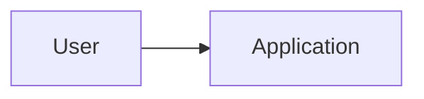
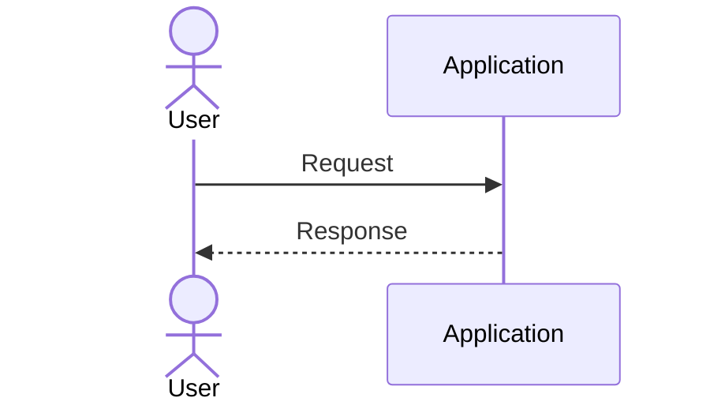

# Technical Design

## Overview

Describe the system structure and main technical approach.

## Architecture Goals

| ID | Goal | Rationale |
| --- | --- | --- |
| AG-001 |  |  |

## System Context

## Containers

| Container | Responsibility | Technology |
| --- | --- | --- |
| Application |  | Python |

## Data Flow

## Key Decisions

| Decision | ADR |
| --- | --- |
|  |  |

## Risks

| ID | Risk | Mitigation |
| --- | --- | --- |
| R-001 |  |  |
