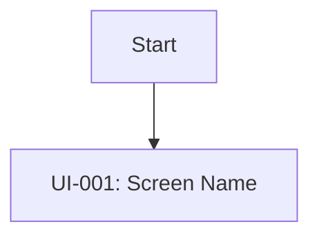

# Screen Transitions

```mermaid
flowchart TD
  Start["Start"] --> Screen1["UI-001: Screen Name"]
```

## Transition Rules

| ID | From | Event | To | Notes |
| --- | --- | --- | --- | --- |
| TR-001 |  |  |  |  |
